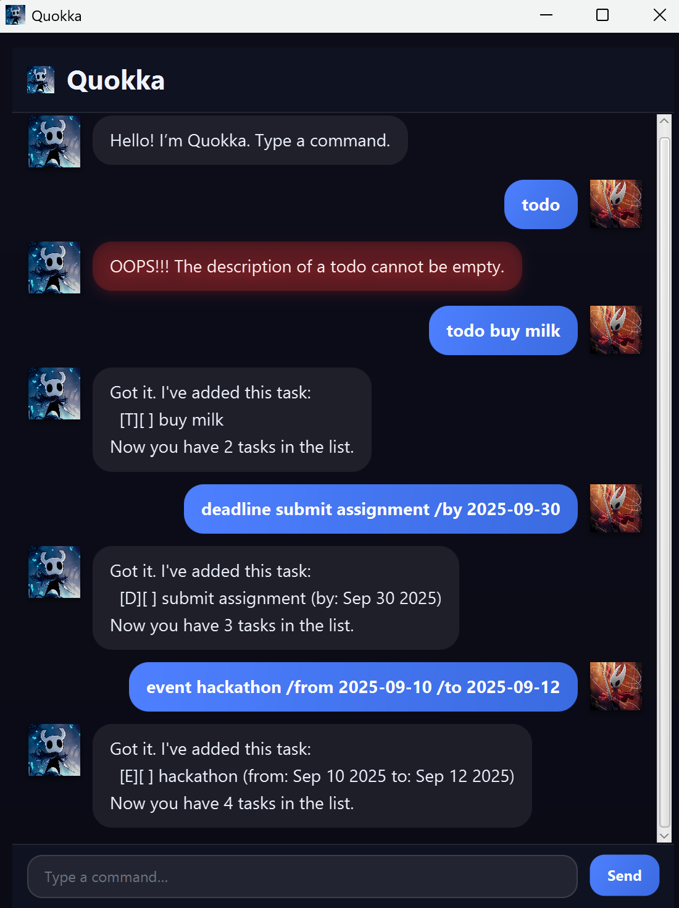

# Quokka — User Guide

Welcome to **Quokka**, a friendly task assistant with a clean JavaFX UI and strong error handling.



---

## Table of Contents
- [Quick Start](#quick-start)
- [Features](#features)
  - [Add a Todo](#add-a-todo)
  - [Add a Deadline](#add-a-deadline)
  - [Add an Event](#add-an-event)
  - [List Tasks](#list-tasks)
  - [Find Tasks](#find-tasks)
  - [Mark / Unmark / Delete](#mark--unmark--delete)
  - [Help](#help)
- [Error Handling](#error-handling)
- [Data File](#data-file)
- [Keyboard Shortcuts](#keyboard-shortcuts)
- [FAQ](#faq)
- [Credits](#credits)

---

## Quick Start
1. Ensure you have Java 17+ installed.
2. Build the fat JAR:
```bash
   ./gradlew clean shadowJar
````

3. Run:

   ```bash
   java -jar build/libs/Quokka.jar
   ```
4. Type a command in the input bar (bottom right). Press **Enter** or click **Send**.

---

## Features

### Add a Todo

```
todo <description>
```

* Example: `todo read book`

### Add a Deadline

```
deadline <description> /by <date>
```

* Example: `deadline submit report /by 2025-09-10`
* Dates are parsed strictly (e.g., **Feb 30** is rejected).

### Add an Event

```
event <description> /from <start-date> /to <end-date>
```

* Example: `event camp /from 2025-09-10 /to 2025-09-12`
* Start must be **strictly before** end.

### List Tasks

```
list
```

### Find Tasks

```
find <keyword>
```

* Example: `find book`

### Mark / Unmark / Delete

```
mark <index>
unmark <index>
delete <index>
```

### Help

```
help
```

---

## Error Handling

Quokka aims to be forgiving and clear:

* **Unknown command** → e.g., “Alas… I do not know this incantation: …”
* **Empty parts / missing flags** → e.g., missing `/by`, or `/from`…`/to`.
* **Invalid dates** → impossible calendar dates (e.g., `2025-02-30`) are rejected.
* **Event range** → start must be **before** end.
* **Duplicates** → adding an identical task warns without crashing.
* **Data file issues** → Quokka auto-creates the folder/file, **skips corrupted lines**, and continues running.

---

## Data File

* Location (default): `data/tasks.txt`
* Saves are **atomic** (write to temp, then move into place).

---

## Keyboard Shortcuts

* **Enter**: Send command
* **Ctrl+L**: Clear conversation area

---

## FAQ

**Q: What Java version do I need?**
A: Java 17+.

---

## Credits

* **Strict date parsing** uses `ResolverStyle.STRICT` as per Java Time (JSR-310) docs.
* JUnit 5 tests use standard APIs per the JUnit 5 user guide.

*All other code authored by the project team. Additional third-party snippets will be listed here as needed.*
